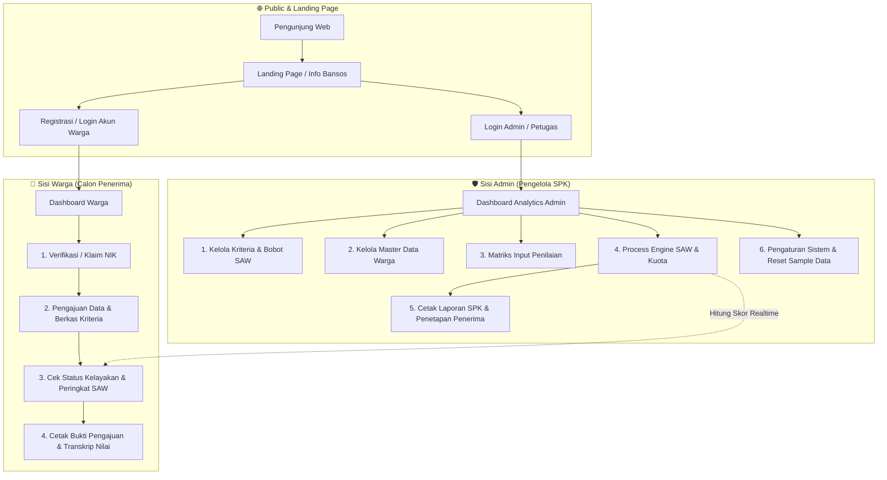

# 📊 Panduan Visual & Alur Penggunaan Aplikasi SPK Bansos (Metode SAW)

Aplikasi **SPK Bansos** (Sistem Pendukung Keputusan Bantuan Sosial) menggunakan metode **Simple Additive Weighting (SAW)** untuk menentukan kelayakan penerima bantuan sosial secara transparan, terukur, dan objektif.

---

## 🔁 Flow Diagram Keseluruhan Sistem



---

## 👤 1. Alur Penggunaan dari Sisi WARGA

### Step-by-Step User Journey Warga:

1. **Registrasi & Login Akun**:
   - Warga mendaftar akun menggunakan Email dan Password di halaman `/register`.
   - Setelah berhasil login, warga diarahkan ke Dashboard Warga (`/dashboard`).

2. **Klaim / Verifikasi NIK**:
   - Pada dashboard, warga melakukan verifikasi NIK (Nomor Induk Kependudukan).
   - Jika NIK terdaftar di sistem desa/kelurahan, data warga akan otomatis terhubung (*claimed*).

3. **Pengajuan Data Mandiri**:
   - Warga melengkapi data indikator kriteria seperti:
     - **Penghasilan Bulanan**
     - **Jumlah Tanggungan Keluarga**
     - **Kondisi Bangunan Rumah**
     - **Status Kepemilikan Aset / Daya Listrik**
   - Data disimpan sebagai draf pengajuan bantuan sosial.

4. **Monitoring Hasil & Transkrip SPK**:
   - Warga dapat melihat **Status Kelayakan** secara transparan:
     - 🟢 **Menerima Bansos**: Masuk dalam kuota peringkat teratas hasil perhitungan SAW.
     - 🔴 **Belum Memenuhi Kuota**: Peringkat di luar batas kuota penerima.
   - Warga dapat mengklik tombol **Cetak Bukti Pengajuan** dan **Cetak Transkrip Seleksi** untuk dokumen arsip pribadi.

### 🖼️ Mockup Visual UI (Sisi Warga)

```
+-----------------------------------------------------------------------------------+
| 🏠 SPK BANSOS  [ Landing ]  [ Dashboard ]  [ Dokumentasi ]         (👤 Warga User v) |
+-----------------------------------------------------------------------------------+
|                                                                                   |
|  👋 Selamat Datang, Ahmad Subagyo!                                                |
|  Status Akun: NIK Terverifikasi (3275010203040001)                                 |
|                                                                                   |
|  +-------------------------------------+  +------------------------------------+  |
|  | 📌 Status Kelayakan Bansos          |  | 📄 Data Berkas Pengajuan Mandiri   |  |
|  |                                     |  |                                    |  |
|  |   [ STATUS: KANDIDAT TERAKREDITASI ] |  |  - Penghasilan: < Rp 1.500.000     |  |
|  |   Peringkat SAW : #3 dari 50 Kuota  |  |  - Tanggungan : 4 Orang            |  |
|  |   Skor Preferensi: 0.892 (Tinggi)   |  |  - Kondisi Rumah: Semi Permanen    |  |
|  |                                     |  |                                    |  |
|  |   [🖨️ Cetak Bukti] [📄 Transkrip]   |  |  [✏️ Edit Data Pengajuan Mandiri]  |  |
|  +-------------------------------------+  +------------------------------------+  |
+-----------------------------------------------------------------------------------+
```

---

## 🛡️ 2. Alur Penggunaan dari Sisi ADMIN

### Step-by-Step User Journey Admin:

1. **Dashboard Analytics (`/dashboard`)**:
   - Menampilkan kartu ringkasan: Total Warga Terdaftar, Total Kriteria, Total Kuota Bansos, dan Persentase Kelayakan.

2. **Manajemen Kriteria & Bobot (`/admin/kriteria`)**:
   - Menentukan kriteria penilaian beserta bobot (total bobot = 100% / 1.0) dan tipe atribut:
     - **BENEFIT**: Semakin besar nilai semakin baik (contoh: Jumlah Tanggungan).
     - **COST**: Semakin kecil nilai semakin baik (contoh: Penghasilan Bulanan).

3. **Manajemen Data Warga (`/admin/data-warga`)**:
   - Tambah, Edit, Hapus, dan Filter data warga calon penerima bansos.

4. **Matriks Input Penilaian (`/admin/penilaian`)**:
   - Mengisi nilai parameter tiap kriteria untuk masing-masing warga dalam bentuk tabel matriks batch.

5. **Engine Perhitungan SAW & Ranking (`/admin/perhitungan`)**:
   - Sistem melakukan eksekusi 4 tahap matematis metode SAW:
     - **Tahap 1: Matriks Keputusan ($X$)**
     - **Tahap 2: Normalisasi Matriks ($R$)**
     - **Tahap 3: Pembobotan Matriks ($V$)**
     - **Tahap 4: Ranking & Penetapan Kuota**
   - Hasil akhir menampilkan daftar warga terurut dari skor tertinggi ke terendah lengkap dengan indikator kuota (*Lolos* / *Tidak Lolos*).

6. **Cetak Laporan & Pengaturan (`/admin/perhitungan/cetak`, `/admin/settings`)**:
   - Cetak laporan PDF/Print resmi yang ditandatangani oleh Kepala Desa / Lurah.
   - Mengatur identitas instansi, logo, favicon, serta opsi reset sample data.

### 🖼️ Mockup Visual UI (Sisi Admin)

```
+-----------------------------------------------------------------------------------+
| 🛡️ ADMIN PANEL  |  📊 Dashboard  | 📋 Kriteria | 👥 Warga | 🧮 Process SAW | ⚙️ Settings |
+-----------------------------------------------------------------------------------+
|                                                                                   |
|  📈 OVERVIEW SPK BANSOS SAW METHOD                                               |
|  +------------------+  +------------------+  +------------------+                 |
|  | Total Warga      |  | Total Kriteria   |  | Kuota Penerima   |                 |
|  | 128 Calon        |  | 5 Indikator      |  | 30 Warga (23.4%) |                 |
|  +------------------+  +------------------+  +------------------+                 |
|                                                                                   |
|  🧮 HASIL PERHITUNGAN & RANKING SAW                                               |
|  +----+-----------------+---------------+-------------+---------------+--------+  |
|  | No | NIK             | Nama Warga    | Nilai (V)   | Status        | Akses  |  |
|  +----+-----------------+---------------+-------------+---------------+--------+  |
|  | 1  | 327508...0012   | Siti Aminah   | 0.954       | 🟢 Penerima   | [Detail]| |
|  | 2  | 327501...0004   | Budi Santoso  | 0.912       | 🟢 Penerima   | [Detail]| |
|  | 3  | 327501...0001   | Ahmad Subagyo | 0.892       | 🟢 Penerima   | [Detail]| |
|  | 4  | 327509...0088   | Joko Widodo   | 0.421       | 🔴 Non-Kuota  | [Detail]| |
|  +----+-----------------+---------------+-------------+---------------+--------+  |
|  [ 🖨️ Cetak Laporan PDF Resmi SPK ]  [ 🔄 Hitung Ulang Matrix SAW ]              |
+-----------------------------------------------------------------------------------+
```

---

## 🧮 Formula Algoritma SAW pada Kode Engine (`SawService.php`)

$$\text{Normalisasi } r_{ij} = \begin{cases} \frac{x_{ij}}{\max_i x_{ij}} & \text{jika atribut Benefit} \\[2ex] \frac{\min_i x_{ij}}{x_{ij}} & \text{jika atribut Cost} \end{cases}$$

$$\text{Nilai Preferensi Final } V_i = \sum_{j=1}^{n} w_j \cdot r_{ij}$$

---

## 📌 Kesimpulan Fitur Berdasarkan Peran

| Fitur / Modul | 👤 Warga | 🛡️ Admin |
| :--- | :---: | :---: |
| Lihat Info Program & Kriteria Bansos | ✅ | ✅ |
| Klaim NIK & Registrasi Mandiri | ✅ | ❌ |
| Input & Edit Pengajuan Berkas Mandiri | ✅ | ❌ |
| Lihat Status Peringkat & Hasil Kelayakan Real-time | ✅ | ✅ |
| Cetak Bukti Pengajuan & Transkrip Mandiri | ✅ | ❌ |
| Kelola Master Kriteria & Bobot (Cost/Benefit) | ❌ | ✅ |
| Kelola Master Data Warga (CRUD All Warga) | ❌ | ✅ |
| Matriks Penilaian Batch Seluruh Warga | ❌ | ✅ |
| Eksekusi Calculation Engine SAW & Penetapan Kuota | ❌ | ✅ |
| Cetak Laporan Resmi SPK PDF | ❌ | ✅ |
| Pengaturan Branding Web & Reset Sample Data | ❌ | ✅ |
